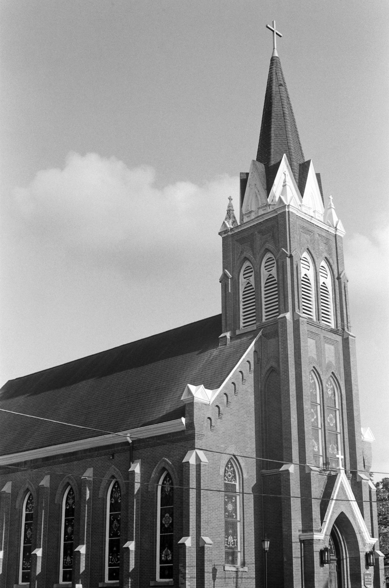
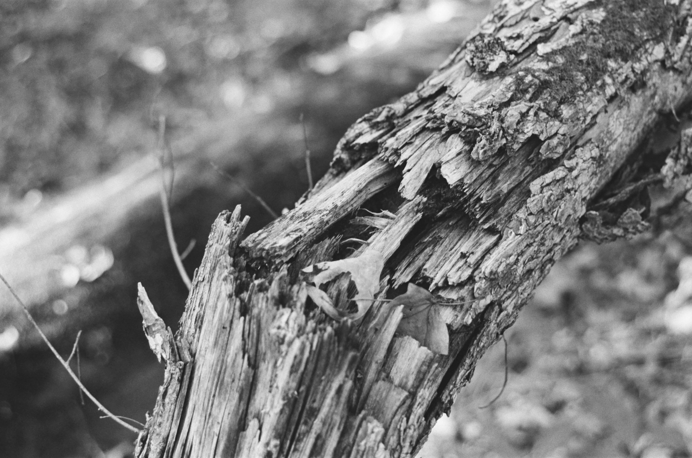

# Photography

Here are some highlights of my 35mm analog photography. I'll occasionally update this until github gets upset with the size of this repository.

Graves at The Ridges, a former mental asylum in Athens, Ohio. Most graves are unlabeled.

St. Paul's Catholic Church in Athens, Ohio.

Fallen tree in the forest outside Athens, Ohio.

Kitt Peak National Observatory, Arizona.

The Nicholas U. Mayall Telescope, home to the DESI Instrument.

333 W Wacker Drive in Chicago, Illinois.